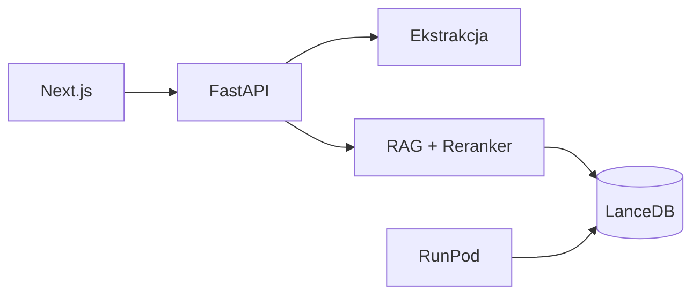

# SIWZ-RAG Lite

Narzędzie do weryfikacji wymagań SIWZ/SWZ i budowy bazy wiedzy z dokumentacji **Palo Alto Cortex** (XDR, XSIAM, XSOAR, XPANSE, Cortex Cloud, AgentiX).

[English version](README.en.md)

## Funkcje

| Funkcja | Opis |
|---------|------|
| **A — Weryfikacja** | PDF/DOCX lub tekst → ekstrakcja wymagań → RAG + LLM → raport z cytatami |
| **B — Sync KB** | RunPod GPU → `cortex-docs-sync` → embedding → portable snapshot LanceDB |

## Szybki start (~10 min)

```bash
git clone https://github.com/n0081183/simple-rag.git siwz-rag-lite
cd siwz-rag-lite
make install    # uv + npm + build frontendu
ollama pull qwen3:8b
make run        # http://localhost:8000
```

Wymagania: Python 3.11+, Node 20+, [Ollama](https://ollama.com), opcjonalnie GPU do lokalnych embeddingów.

## Architektura

Zobacz [docs/architecture.md](docs/architecture.md) i ADR w [docs/decisions/](docs/decisions/).



## Komendy Makefile

| Komenda | Opis |
|---------|------|
| `make install` | Zależności + build UI |
| `make dev` | Backend :8000 + frontend :3000 |
| `make run` | Produkcja (FastAPI + static) |
| `make eval` | Gold set 20 wymagań |
| `make sync-kb` | Sync bazy (CLI) |
| `make preflight` | Sprawdzenie Ollama / LanceDB |
| `make seed-kb` | Budowa seedowej bazy wiedzy (dev) |

## Bezpieczeństwo

Klucze RunPod i API LLM — **wyłącznie keychain OS** (`siwz-rag-lite`), nigdy w repo.

## Status

- [x] M0: Szkielet, ADR, CI
- [x] M1: Ekstrakcja LLM, RAG, weryfikacja, raport MD, gold set 20
- [x] M2: RunPod SSH pipeline, snapshot `.tar.zst`, atomic swap
- [x] M3: DOCX/XLSX, auto-detect (top 3 + potwierdzenie), LLM toggle, anonimizacja raportów
- [ ] M4: Playwright E2E, Tauri (opcjonalnie)

## Licencja

MIT — zobacz [LICENSE](LICENSE).
