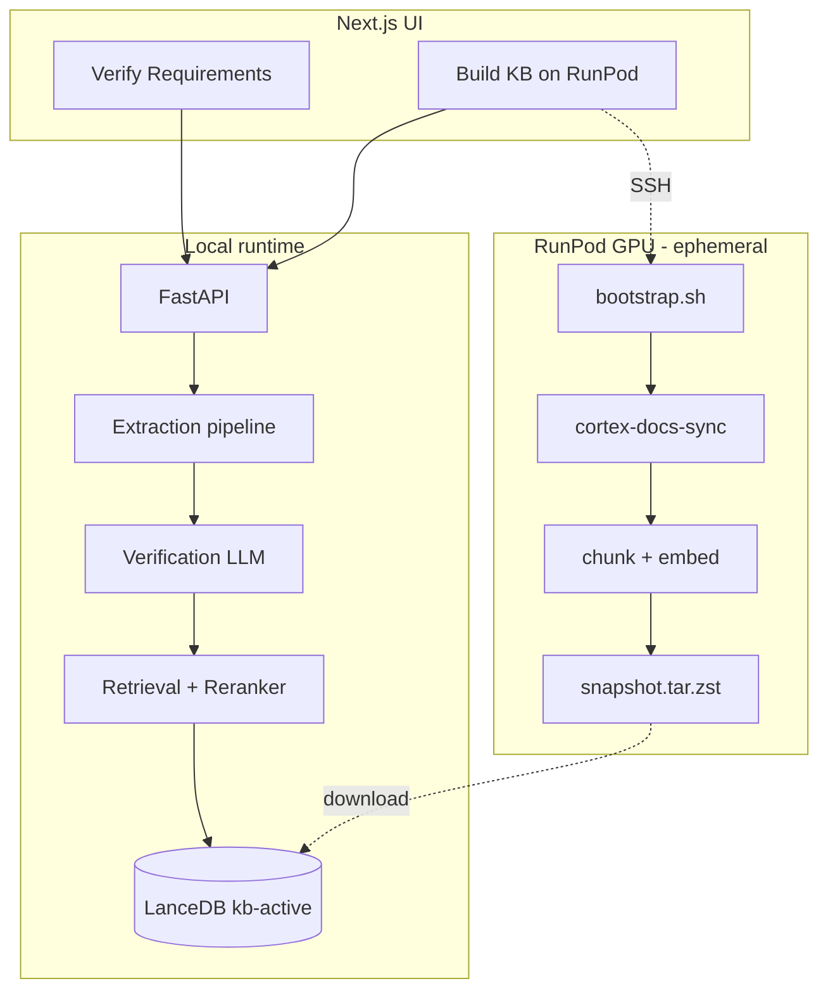

# Architecture

## Overview

SIWZ-RAG Lite is a local-first tool for verifying public procurement requirements (SIWZ/RFP) against Palo Alto Cortex documentation.

## Function A — Verification

1. **Parse** PDF/DOCX (Docling) or pasted text
2. **Pre-split** heuristic blocks (`presplit.py`)
3. **Validate** each block via LLM JSON schema
4. **User review** extracted requirements (UI)
5. **Per-requirement RAG**: BGE-M3 hybrid + reranker + domain expansion
6. **Verify** with 4-step CoT structured output
7. **Report** MD / DOCX / XLSX

## Function B — KB sync

1. User provides RunPod API key (keychain) + pod SSH
2. Local orchestrator runs remote pipeline
3. Atomic swap: `kb-staging` → `kb-active`, previous kept for rollback

## Decisions

- [ADR 001: LanceDB](decisions/001-vector-db.md)
- [ADR 002: SSH + RunPod API](decisions/002-runpod-connection.md)
- [ADR 003: Ollama + API opt-in](decisions/003-llm-strategy.md)
